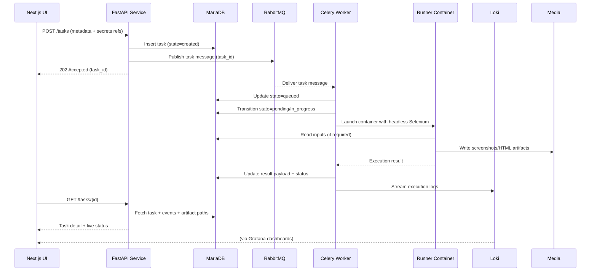

# Celery Automation Platform – Component & Flow Diagram

## Component Topology
```mermaid
graph TD
    subgraph Client Layer
        U[Next.js Portal]
    end

    subgraph API Layer
        APIFW[FastAPI]
    end

    subgraph Data Layer
        DB[(MariaDB)]
        Media[(Media Folder)]
    end

    subgraph Messaging
        MQ[(RabbitMQ)]
    end

    subgraph Execution Layer
        CW[Celery Worker Pool]
        subgraph Runners
            R1[[Runner Container 1\nHeadless Chrome (selenium/standalone-chrome)]]
            Rn[[Runner Container N\nHeadless Chrome (selenium/standalone-chrome)]]
        end
    end

    subgraph Observability
        Loki[(Loki)]
        Grafana[(Grafana)]
    end

    U -->|REST/WebSocket| APIFW
    APIFW -->|Persist tasks, secrets, metadata| DB
    APIFW -->|Enqueue task request| MQ
    CW -->|Consume jobs| MQ
    CW -->|State updates, heartbeats| DB
    CW -->|Emit structured logs| Loki
    Loki -->|Visualize dashboards| Grafana
    CW -->|Launch workloads| R1
    CW -->|Launch workloads| Rn
    R1 -->|Store screenshots & HTML| Media
    Rn -->|Store screenshots & HTML| Media
    CW -->|Attach artifact paths| DB
    APIFW -->|Serve artifacts| U
```

## Task Lifecycle Sequence


## Notes
- Secrets remain in MariaDB for the initial phase; API issues scoped read access to workers at runtime.
- Runner containers are short-lived Docker instances bundled with browsers, drivers, and automation code; workers orchestrate their lifecycle.
- Grafana dashboards can combine Loki log queries with task metadata (via annotations) to trace failures quickly.
- Local media folder can evolve into object storage later; abstract path handling in the API to minimize future migration effort.
