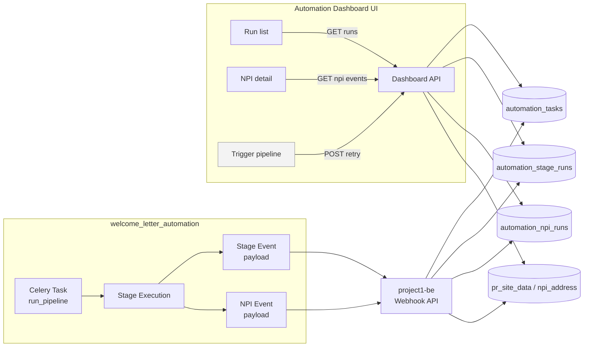

# Automation Dashboard Flow Overview

Use this primer when you need to explain how the Welcome Letter automation and the dashboard talk to each other. It purposely skips implementation detail—see `AUTOMATION_DASHBOARD_SPEC.md` for the build plan.

---

## 1. Narrative

1. A Celery worker in `welcome_letter_automation` starts `run_pipeline`.
2. As each stage runs (Monday ingest → PR Site enrichment → QuickCap submission → Monday status update), the runner sends two kinds of messages to `project1-be`:
   - **Stage events** – “Stage X started/completed/failed.”
   - **NPI events** – “NPI 1234567890 finished QuickCap with these results.”
3. `project1-be` persists the events, updates its automation tables, and links them to existing provider data (`pr_site_data`, `npi_address`).
4. The dashboard UI calls read-only APIs on `project1-be` to render:
   - Recent runs and their status.
   - Stage timelines and artifacts.
   - Per-NPI history (inputs, outputs, diffs).
5. Optional: ops teams can trigger retries directly from the dashboard once that endpoint is enabled.

---

## 2. High-level diagram

---

## 3. Data produced per stage

| Stage | Key data captured | Sent via |
| --- | --- | --- |
| Monday ingest | List of NPIs fetched, screenshots of board | Stage event (summary), artifact links |
| PR Site enrichment | Each NPI’s enriched data (addresses, taxonomy), failures | NPI events + stage summary |
| QuickCap submission | Submission outcome, updated addresses, artifact evidence | NPI events |
| Monday status update | Board row status changes, remarks added | NPI events |

Backend keeps the latest snapshot in `pr_site_data` / `npi_address` and links each change to the originating task.

---

## 4. APIs the dashboard uses

- `GET /api/automation/dashboard/runs` – fetch list of runs.
- `GET /api/automation/dashboard/runs/{task_id}` – see stage timeline.
- `GET /api/automation/dashboard/runs/{task_id}/npis/{npi}` – inspect a single provider.
- `POST /api/automation/tasks/{task_id}/retry` – optional retry trigger.

All endpoints live in `project1-be`.

---

## 5. Glossary

- **Task** – A single end-to-end pipeline execution (Celery task + database record).
- **Stage run** – One stage (e.g., `quickcap_submission`) inside a task.
- **NPI event** – Per-provider record of what happened within a stage.
- **Artifact** – Evidence file (screenshot, HTML, JSON) stored alongside a run.

---

